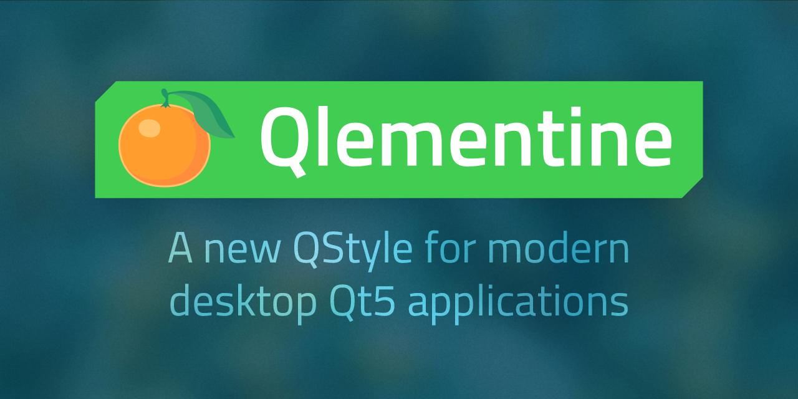
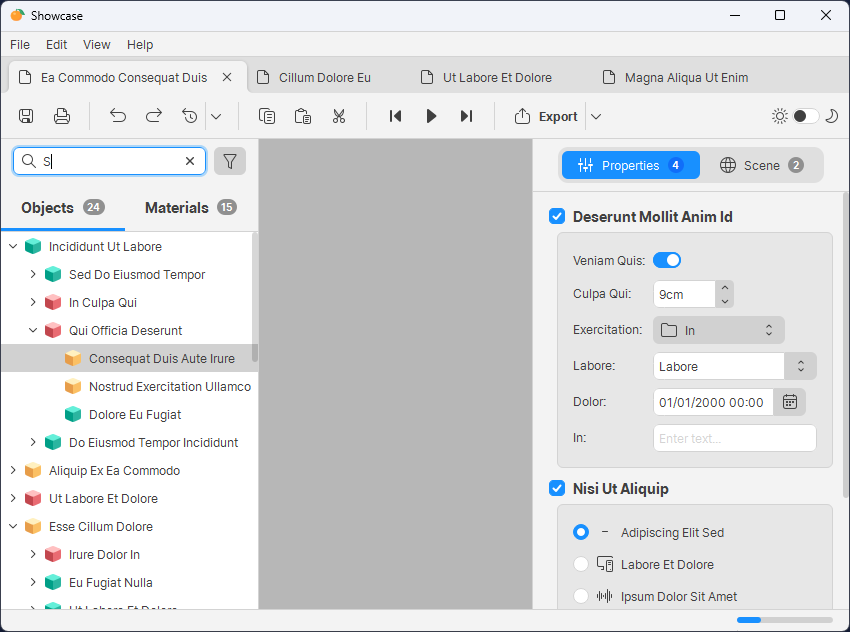
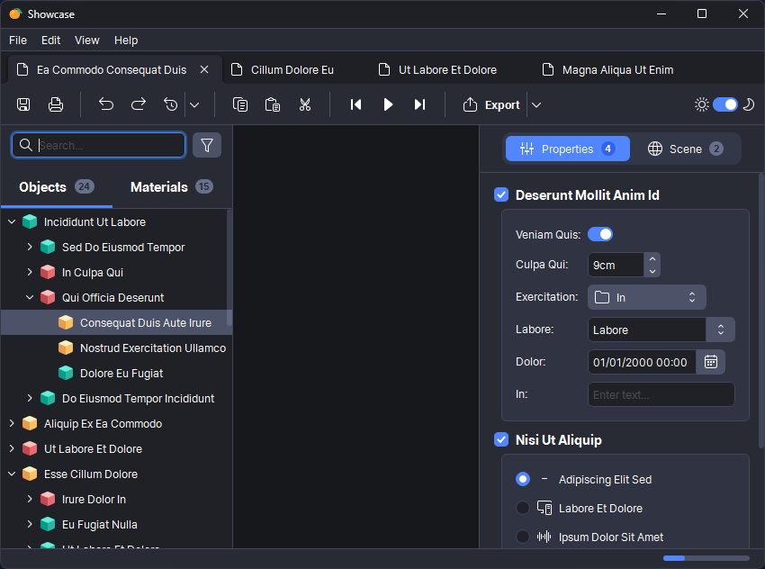

  

# Qlementine

Modern QStyle for desktop Qt6 applications.

See [documentation](https://oclero.github.io/qlementine) for more information.

  
  

---

### Table of Contents

- [Requirements](#requirements)
- [Features](#features)
- [Usage](#usage)
- [Creator](#creator)
- [License](#license)

---

## Requirements

- Windows, MacOS or Linux.
- [CMake 3.21.0+](https://cmake.org/download)
- [Qt 6.8.0+](https://www.qt.io/download-qt-installer)

## Features

This library contains:

- A custom `QStyle` named `QlementineStyle`, that implements all the necessary API to give a modern look and feel to your Qt application. It's a **drop-in replacement** for the default `QStyle`.
- Lots of utilities to help you write beautiful `QWidgets` that fits well with the style.
- A collection of new `QWidgets` that are missing in Qt's standard collection, such as `Switch`.

## Usage

See [documentation](docs/usage.md) for details. Basically, you just need to add Qlementine as a dependency with CMake, and call `QApplication::setStyle`.

## Creator

**Olivier Cléro** | [email](mailto:oclero@pm.me) | [website](https://www.olivierclero.com) | [github](https://www.github.com/oclero) | [gitlab](https://www.gitlab.com/oclero)

## License

**Qlementine** is available under the MIT license. See the [LICENSE](LICENSE) file for more info.
