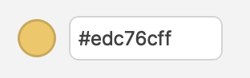
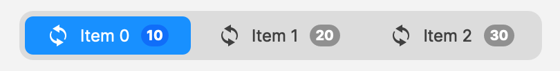
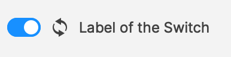

# Widgets

Qlementine provides a collection of `QWidgets` to extend Qt's standard ones.

More information about them coming soon. You can check them in the Sandbox application, at the moment.

## AboutDialog

A standard "About" window that you can use to quickly display basic information about your app.


## AbstractItemListWidget

Base class for [`NavigationBar`](#navigationbar) and [`SegmentedControl`](#segmentedcontrol).

## Action

Improves `QAction` by adding predicates (lambda functions) to update the state.

## ActionButton

Links a `QPushButton` to a `QAction`.

## ColorButton

Allows to pick and display a `QColor`.

## ColorEditor

Displays a `ColorButton` and the color value in an editable `QLineEdit` besides.



## CommandLinkButton

Improves `QCommandLinkButton` by supporting the `icon` property of `QAbstractButton`.


## Expander

Container that allows to hide/show its content with a nice height animation.

## IconWidget

Widget that just shows an icon.

## Label

Improves `QLabel`` by allowing text roles as with HTML (headings h1, etc.).


## LineEdit

Improves `QLineEdit` by allowing statuses to display feedback for user (valid, error, warning, etc.).


## LoadingSpinner

A small widget that you can use to show that an asynchronous operation is currently running.


## Menu

Improves `QMenu` by adding predicates (lambda functions) to update state.

## NavigationBar

A widget that allows to switch between a range of elements, such as seen on Android.


## NotificationBadge

A small badge to display a notification (with or without text) on another widget.

```cpp
// The parent set to the constructor is not important.
auto* badge = new NotificationBadge(someParent);

// The badge's parent will change to theWidget's parent.
badge->setWidget(theWidget);
```


## Popover

A popup-like widget that opens in a separate system window, with a drop shadow and corner radiuses (hence transparency) and an opacity animation when toggling visibility.


## PopoverButton

A button that opens a `Popover` when clicked.

## RoundedFocusFrame

Improves `QFocusFrame` by adding a corner radius property.

## SegmentedControl

A widget that allows to switch between a range of elements, such as seen on iOS or macOS.



## StatusBadgeWidget

Widget to display a status icon: info, warning, error, success. Available in two standard sizes.


## Switch

The famous Switch to toggle between states.


